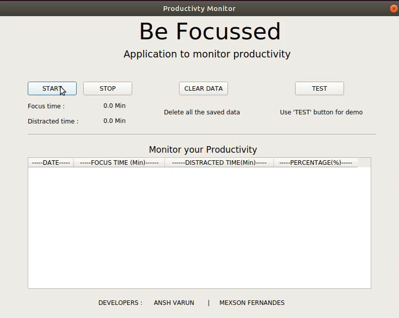

#  Be Focussed - PyQT Desktop app for Windows and Linux

## Packages :
 - imutils
 - keras 
 - tensorflow
 - mkl-service
 - pyqt5
 - sqlite3

## How to use:
 - Install all the required packages as mentioned above.
 - Open terminal or command prompt in "app" folder.
 - Run command "python3 main.py".

## Support:
> If you found  this project helpful, consider buying us a cup of :coffee:
>
> * [PayPal](https://paypal.me/RoboMex?locale.x=en_GB)

## Credits : 
  - Special thanks to <a href="https://github.com/johannesharmse">Johannes Harmse</a>
  - github.com@johannesharmse/distraction_detection
  
## Developers : 
  - Ansh Varun
  - Mexson Fernandes
  
## Application GUI:

## User monitoring:
 - When user is focussed.

 
 - When user is distracted.

## Demo video:

  

