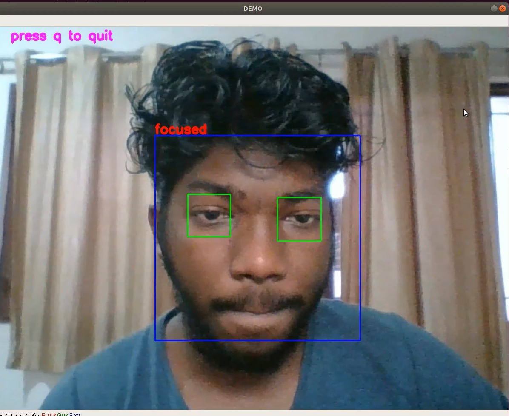
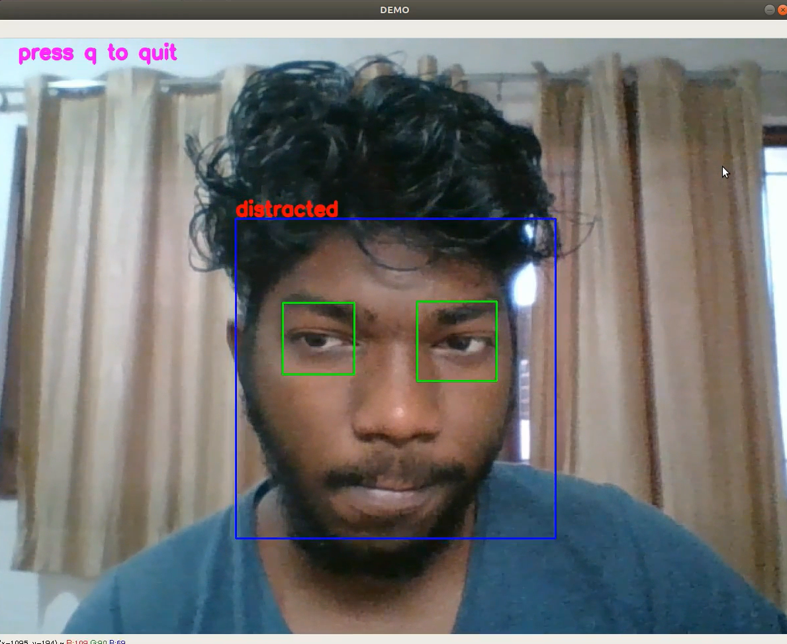

#  Be Focussed - PyQT Desktop app for Windows and Linux

## Packages :
 - imutils
 - keras 
 - tensorflow
 - mkl-service
 - pyqt5

## Credits : 
  - Special thanks to <a href="https://github.com/johannesharmse">Johannes Harmse</a>
  - github.com@johannesharmse/distraction_detection
  
## Developers : 
  - Ansh Varun (PyQT + SQLite Database)
  - Mexson Fernandes
  
## Application GUI:

## User monitoring:
 - When user is focussed.

 
 - When user is distracted.

